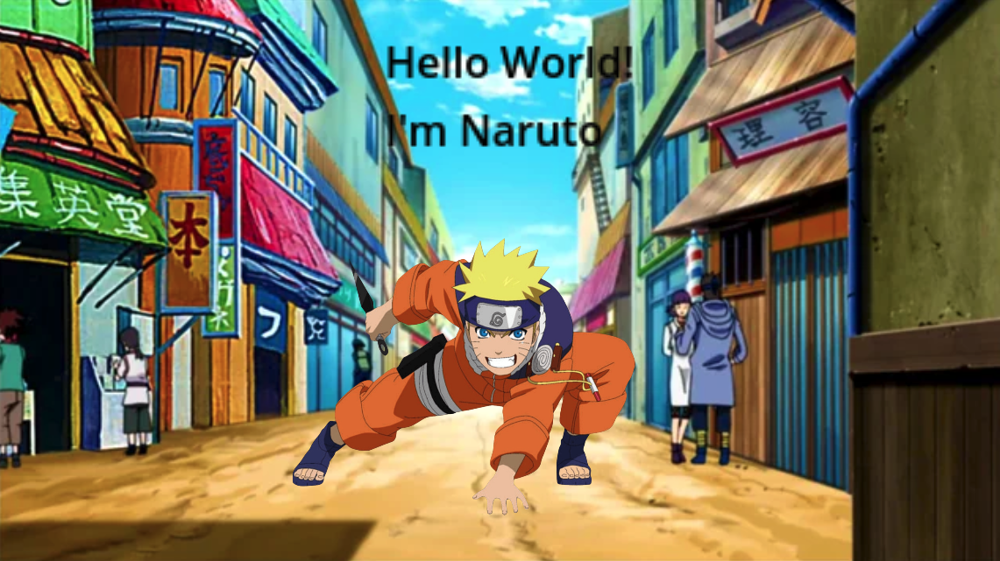
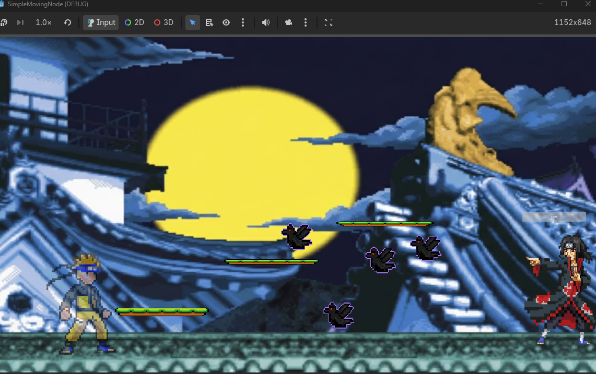
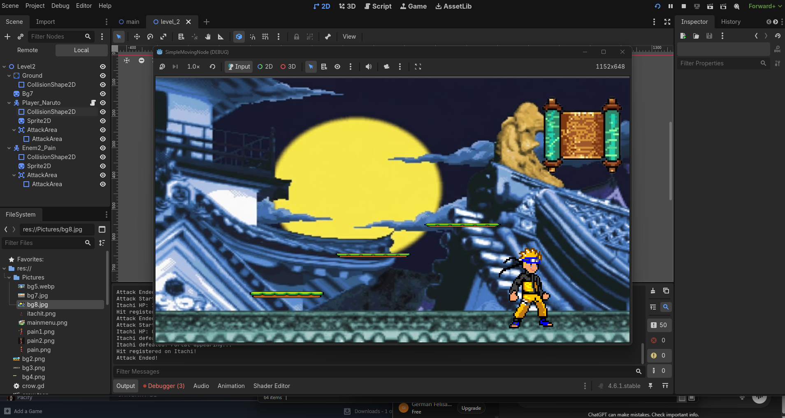
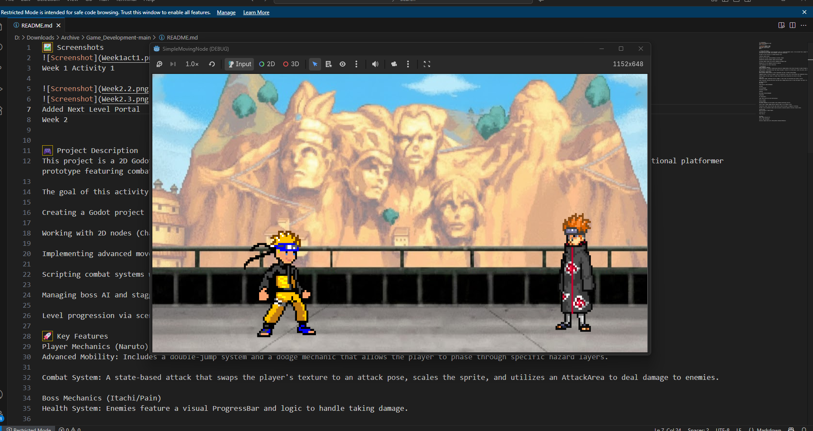

🖼️ Screenshots

Week 1 Activity 1

Added Next Level Portal

Week 2

🎮 Project Description
This project is a 2D Godot scene developed as part of a Game Development course. It has evolved from a simple "Hello World" project into a functional platformer prototype featuring combat, boss mechanics, and scene transitions.

The goal of this activity is to become familiar with:

Creating a Godot project

Working with 2D nodes (CharacterBody2D, Sprite2D, Area2D)

Implementing advanced movement (Double Jump and Dodge)

Scripting combat systems with texture swapping and damage logic

Managing boss AI and staggered projectile spawning

Level progression via scene transitions

🚀 Key Features
Player Mechanics (Naruto)
Advanced Mobility: Includes a double-jump system and a dodge mechanic that allows the player to phase through specific hazard layers.

Combat System: A state-based attack that swaps the player's texture to an attack pose, scales the sprite, and utilizes an AttackArea to deal damage to enemies.

Boss Mechanics (Itachi/Pain)
Health System: Enemies feature a visual ProgressBar and logic to handle taking damage.

Staggered Attacks: The boss can spawn a swarm of projectiles (crows) with a time interval and randomized vertical offsets.

Dynamic Posing: The boss swaps to a larger attack texture while projectiles are active on the map.

Level Flow
Progression Trigger: Defeating the boss triggers a "Level Clear" UI notification and reveals a portal.

Scene Transition: Entering the portal uses get_tree().change_scene_to_file() to move the player from Level 1 to Level 2 (Konoha Village).

📂 Scene Structure
Main Node

Player_Naruto (CharacterBody2D)

Sprite2D

CollisionShape2D

AttackArea (Area2D)

Camera2D

Boss_Enemy (CharacterBody2D)

ProgressBar

UI (CanvasLayer)

Label (Hello World and Level Notifications)

Portal (Area2D)

▶️ How It Works
The player navigates the environment using standard platforming controls.

Attack inputs trigger damage detection against nodes in the "Enemies" group.

Projectiles (Crows) reset the level upon contact unless the player is dodging or attacking.

The Main script coordinates camera limits and portal visibility based on the boss's health status.

📦 How to Run
Open the project in Godot Engine.

Load main.tscn.

Press Play ▶️.

👤 Author
Name: German Felisarta IV

Course: Game Development

Activity: Simple Scene with a Moving Node & Advanced Mechanics